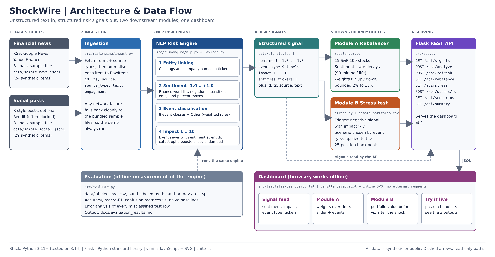

# ShockWire: Real-Time AI/NLP Financial Risk Engine - S&P Global & Crisil Campus Hackathon

**Candidate Name:** Medhansh Poojari
**College Email ID:** poojari.2024ug1099@iiitranchi.ac.in
**College / Campus:** IIIT Ranchi
**Demo Video Link:** TODO: add the unlisted YouTube link here
**Slide Deck Link (if hosted externally):** Not hosted externally. The deck is in this repo: [docs/presentation.pdf](docs/presentation.pdf)

---

## 1. Project Overview / Problem Statement & Approach

Banks and index managers learn about risk from unstructured text: news wires, analyst notes and social posts. Reading it by hand does not scale, and a headline that moves a market in minutes can sit unread for hours. The goal of this project is to turn that text stream into **structured, machine-readable risk signals** that other systems can act on.

ShockWire is a Python pipeline with an **AI/NLP Risk Engine** at its core. It ingests text from two source types (financial news and social posts) and, for every item, outputs a **sentiment score** (-1.0 to +1.0), an **event classification** (Geopolitical, Macroeconomic, Credit Event, Merger/Acquisition, Product Launch, Earnings, Regulatory/Legal, Cyber/Operational, or Other) and an **impact score** (1 to 10), plus the stock tickers mentioned. The signals are written to `data/signals.jsonl` and served over a REST API.

Two downstream modules show what the signals are good for. **Module A (tactical)** is a sentiment-driven rebalancer for a mock 15-stock index drawn from the S&P 100: positive sentiment raises a stock's weight, negative lowers it, with weights bounded between 2% and 15%. **Module B (strategic)** is an event-driven stress tester: when a negative, high-impact event is detected (impact above 7), it selects a shock scenario by event type and re-values a synthetic 25-position wholesale-banking book (loans, bonds, derivatives and equities), showing portfolio value before and after. Both modules, the signal feed and a live "analyze a headline" box are on one dashboard.

The NLP is deliberately a **transparent, finance-tuned word-list model** with rule-based event classification, not a black-box neural network. Every score can be traced to specific words, the system runs anywhere with no model downloads, and it is evaluated honestly on a hand-labeled headline set against naive baselines (see section 5).

## 2. Architecture & Tech Stack



**Data flow:** text sources -> ingestion (normalised `RawItem`) -> NLP Risk Engine -> structured signals (`data/signals.jsonl` and `/api/signals`) -> Module A and Module B -> Flask REST API -> browser dashboard. A separate script, `src/evaluate.py`, measures the engine against a hand-labeled set.

**Tech stack**

| Layer | Choice | Why |
|---|---|---|
| Language | Python 3.11+ (tested on 3.14.2, Windows) | Readable, standard-library friendly |
| NLP | Custom finance word list (negation, intensifiers, emoji, percent moves) + weighted regex event rules | Explainable, fast, no downloads, easy to defend |
| API | Flask | Small and simple REST layer |
| Dashboard | One HTML file, vanilla JavaScript + inline SVG | Works offline, no build step, no external requests |
| Data | JSONL and CSV files in `data/` | No database needed at this scale |
| Tests | `unittest` (standard library) | Zero extra dependencies |

Flask is the only third-party dependency.

**Repository layout**

```
├── README.md
├── requirements.txt
├── LICENSE
├── src/
│   ├── app.py                 Flask API + dashboard server
│   ├── evaluate.py            Evaluation against hand-labeled headlines
│   ├── riskengine/
│   │   ├── ingest.py          Sources and normalisation
│   │   ├── lexicon.py         Sentiment words, event rules, severities
│   │   ├── nlp.py             Sentiment, event type, impact, tickers
│   │   ├── pipeline.py        Ingest -> analyse -> signals.jsonl
│   │   ├── rebalancer.py      Module A
│   │   └── stress.py          Module B
│   └── templates/dashboard.html
├── data/                      Sample and synthetic data used by the demo
├── scripts/make_sample_data.py
├── tests/                     unittest suite
└── docs/                      Deck, architecture diagram, PRD, evaluation results
```

## 3. Dataset Used

All data in this repository is **synthetic or hand-written by the author**. No proprietary or client data is used.

| File | What it is | Nature |
|---|---|---|
| `data/sample_news.jsonl` | 24 financial news headlines across one simulated trading day | Synthetic, written for the demo |
| `data/sample_social.jsonl` | 29 social posts in the style of X/Twitter and Reddit, with likes and retweets | Synthetic, written for the demo |
| `data/sample_portfolio.csv` | 25 positions (loans, bonds, derivatives, equities), about $1,266.7M total market value, fictional counterparties | Synthetic |
| `data/signals.jsonl` | Engine output generated from the files above | Generated |
| `data/labeled_eval.csv` | Headlines hand-labeled by the author with sentiment and event type, used to evaluate the engine | Hand-written and hand-labeled (TODO: confirm row count after labeling) |

**Assumptions and honest limitations of the data**
- The sample day is a **scripted story** (a geopolitical shock, then a credit event) so the demo shows the full pipeline. It is not a record of real events and says nothing about real market behaviour.
- The engine can also fetch **live headlines** from public RSS feeds (Google News, Yahoo Finance) with `--live`. A live run overwrites `data/signals.jsonl` with the fetched items, so restore the file (`git checkout data/signals.jsonl`) rather than committing live headlines. Live data is also noisier than the sample data. Reddit's public endpoint blocked automated requests during testing, so the "social" source in the demo is the simulated sample file. The code falls back to the sample files automatically.
- Stress-test shocks and portfolio sensitivities (duration, spread duration, PD, LGD, DV01, CS01) are **illustrative**, chosen to be plausible, and not calibrated to a regulator's scenario.

## 4. Quickstart & Installation

**Runtime:** Python 3.11 or newer. Developed and tested with Python 3.14.2 on Windows (PowerShell). The only dependency is Flask.

```bash
git clone https://github.com/Medhanshug99/iiitranchi-medhansh-poojari-hackathon.git
cd iiitranchi-medhansh-poojari-hackathon

# create and activate a virtual environment
python -m venv .venv
.venv\Scripts\Activate.ps1          # Windows PowerShell
# source .venv/bin/activate         # macOS / Linux

pip install -r requirements.txt

# run the app (from the repository root)
python -m src.app
```

Then open **http://127.0.0.1:5000** in a browser. The dashboard loads with the sample data, no internet needed.

If PowerShell blocks the activation script, run `Set-ExecutionPolicy -Scope Process -ExecutionPolicy Bypass` in that window first, or call `.venv\Scripts\python.exe` directly.

**Other commands (from the repository root)**

```bash
python -m unittest discover -v     # run the test suite
python -m src.evaluate             # evaluate the engine on data/labeled_eval.csv
python -m src.app --live           # try live RSS headlines (falls back to samples)
python -m src.riskengine.pipeline  # regenerate data/signals.jsonl only
python scripts/make_sample_data.py # regenerate the synthetic sample files
git checkout data/sample_news.jsonl data/sample_social.jsonl data/signals.jsonl
```

Run commands from the repository root so that `python -m src.app` can find the package.

## 5. Key Results & Domain Impact

**What the prototype demonstrates**
- **NLP Risk Engine:** 53 items from two source types become structured signals with sentiment, event type, impact and tickers. In the sample day, the missile-strike headline scores 9.5/10 impact as Geopolitical, and the regional-lender default scores 9.5/10 as a Credit Event.
- **Module A:** across the sample day the index weights shift towards positive-sentiment names and away from negative ones, always summing to 100% and staying within 2% to 15% per stock. Cumulative one-way turnover over all rebalance steps is 93.4%.
- **Module B:** negative events with impact above 7 trigger stress runs. For example, the Geopolitical scenario on the $1,266.7M synthetic book gives about -$43.5M (-3.4%), the Credit Event scenario about -$89.7M (-7.1%), and the textbook "equity -10%, rates +200bp" case about -$67.0M (-5.3%). Derivative hedges gain while loans, bonds and equities lose, which is visible in the by-asset-type view.
- **Verified correctness:** the test suite checks sentiment, event classification, impact bounds, rebalancer invariants, hand-calculated stress P&L for individual positions, trigger and de-duplication rules, ingestion fallback and every API endpoint. Run `python -m unittest discover -v`.

**Engine evaluation** on hand-labeled headlines (dev/test split, full tables in [docs/evaluation_results.md](docs/evaluation_results.md)):

| Task | Engine (test split) | Best naive baseline |
|---|---|---|
| Sentiment accuracy | TODO | TODO |
| Event-type accuracy | TODO | TODO |

*(Fill these in from the real output of `python -m src.evaluate`. Do not estimate them.)*

**Domain impact**
- **Speed and coverage:** a risk team can screen far more text than a person can read, and see which items matter first through the impact score.
- **From text to action:** the same structured signal drives a tactical response (rebalancing) and a strategic one (stress testing), so the link between "what happened" and "what could it cost us" is automatic and auditable.
- **Explainability:** every score traces to named words and rules, which suits regulated environments where a black-box model is hard to justify.
- **Limits and next steps:** a word-list model misses sarcasm and context (for example, an analyst downgrade versus a credit-rating downgrade). Natural upgrades are a pretrained finance language model behind the same interface, calibration of impact against realised market moves, regulator scenario libraries for stress tests, and a streaming ingestion layer.

## AI Assistance Disclosure

This project was built with the help of AI coding assistants for code generation, review and documentation. The author set the scope, reviewed the code, ran the tests and the evaluation, hand-labeled the evaluation data, and is responsible for every design decision described here.

## License

MIT, see [LICENSE](LICENSE).
